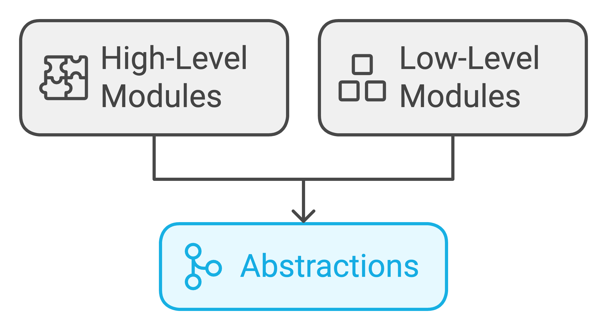

1. **What is a design pattern?**

   A design pattern is a well-proven solution for solving specific problems/tasks in software development. Design patterns are reusable solutions that can be applied to commonly occurring problems in software design. They provide a template for solving issues that can be used in many different situations.

   Key points about design patterns:

   - They are reusable across different problems and projects
   - They provide solutions that help to make code more flexible, reusable and maintainable
   - They provide a template for solving problems that can be used in many different situations
   - They are language-neutral and can be applied to any object-oriented programming language
   - They help to create a shared vocabulary for communicating solutions between developers

2. **What are the different categories of Java Design patterns?**

   Java Design Patterns are mainly divided into three categories:

   1. **Creational Design Patterns**

      - These patterns deal with object creation mechanisms
      - They help make a system independent of how its objects are created, composed, and represented
      - Examples: Singleton, Factory, Abstract Factory, Builder, Prototype

   2. **Structural Design Patterns**

      - These patterns deal with object composition and relationships between objects
      - They help ensure that when one part of a system changes, the entire system doesn't need to change
      - Examples: Adapter, Bridge, Filter, Composite, Decorator, Facade, Flyweight, Proxy

   3. **Behavioral Design Patterns**

      - These patterns deal with communication between objects
      - They characterize complex control flow that's difficult to follow at run-time
      - Examples: Chain of Responsibility, Command, Interpreter, Iterator, Mediator, Memento, Observer, State, Strategy, Template Method, Visitor

   4. **J2EE Design Patterns**
      - These patterns are specifically concerned with the presentation tier in Java EE applications
      - They are used to solve common problems in distributed systems and enterprise applications
      - Examples: MVC Pattern, Business Delegate, Composite Entity, Data Access Object (DAO), Front Controller, Intercepting Filter, Service Locator, Transfer Object

3. **What is the difference between factory and abstract factory pattern?**

   | Aspect            | Factory Pattern                                    | Abstract Factory Pattern                                |
   | ----------------- | -------------------------------------------------- | ------------------------------------------------------- |
   | Purpose           | Creates objects of a single family                 | Creates objects of multiple related families            |
   | Abstraction Level | Deals with single product                          | Deals with product families                             |
   | Implementation    | Uses a single factory method                       | Uses multiple factory methods                           |
   | Flexibility       | Less flexible, focused on one product type         | More flexible, can create multiple product types        |
   | Complexity        | Simpler to implement                               | More complex implementation                             |
   | When to Use       | When system needs to create objects of single type | When system needs to create families of related objects |
   | Example Use Case  | Creating different types of documents              | Creating UI elements for different operating systems    |
   | Extension         | Requires modifying existing factory                | Can add new factories without modifying existing ones   |

   Here's an example of Factory Pattern:

   ```java
   // Product interface
   interface Animal {
       void makeSound();
   }

   // Concrete products
   class Dog implements Animal {
       @Override
       public void makeSound() {
           System.out.println("Woof!");
       }
   }

   class Cat implements Animal {
       @Override
       public void makeSound() {
           System.out.println("Meow!");
       }
   }

   // Factory class
   class AnimalFactory {
       public Animal createAnimal(String type) {
           if (type.equalsIgnoreCase("dog")) {
               return new Dog();
           } else if (type.equalsIgnoreCase("cat")) {
               return new Cat();
           }
           return null;
       }
   }
   ```

   Here's an example of Abstract Factory Pattern:

   ```java
   // Abstract products
   interface Button {
       void paint();
   }

   interface Checkbox {
       void toggle();
   }

   // Concrete products for Windows
   class WindowsButton implements Button {
       @Override
       public void paint() {
           System.out.println("Render Windows button");
       }
   }

   class WindowsCheckbox implements Checkbox {
       @Override
       public void toggle() {
           System.out.println("Toggle Windows checkbox");
       }
   }

   // Concrete products for MacOS
   class MacButton implements Button {
       @Override
       public void paint() {
           System.out.println("Render MacOS button");
       }
   }

   class MacCheckbox implements Checkbox {
       @Override
       public void toggle() {
           System.out.println("Toggle MacOS checkbox");
       }
   }

   // Abstract factory interface
   interface GUIFactory {
       Button createButton();
       Checkbox createCheckbox();
   }

   // Concrete factories
   class WindowsFactory implements GUIFactory {
       @Override
       public Button createButton() {
           return new WindowsButton();
       }

       @Override
       public Checkbox createCheckbox() {
           return new WindowsCheckbox();
       }
   }

   class MacFactory implements GUIFactory {
       @Override
       public Button createButton() {
           return new MacButton();
       }

       @Override
       public Checkbox createCheckbox() {
           return new MacCheckbox();
       }
   }
   ```

4. **Example of Open-Closed Principle: Abstract Factory Design Pattern**

   The Abstract Factory design pattern is an excellent example of the Open-Closed Principle (OCP). In this pattern, the code is open for extension but closed for modification.

   Let's analyze the existing code(provided in the previous example) structure:

   1. We have two interfaces: `Button` and `Checkbox`, which define the core methods for UI elements.

   2. Platform-specific implementations exist for both interfaces:

      - `WindowsButton` and `WindowsCheckbox` for Windows
      - `MacButton` and `MacCheckbox` for MacOS

   3. The `GUIFactory` interface defines an abstract factory method for creating platform-specific UI components.

   4. Concrete factory classes (`WindowsFactory` and `MacFactory`) implement the `GUIFactory` interface,
      providing platform-specific object creation methods.

   This design demonstrates the Open-Closed Principle because:

   - New platform factories can be added without modifying existing code
   - Each platform has its own implementation of UI components
   - The abstraction allows for easy extension of supported platforms

5. **What are SOLID Principles?**

   SOLID is an acronym for five object-oriented design principles that help create more maintainable, flexible, and scalable software:

   1. **S**ingle Responsibility Principle (SRP)

      - A class should have only one reason to change
      - Each class should have only one job or responsibility

   2. **O**pen-Closed Principle (OCP)

      - Software entities should be open for extension but closed for modification
      - New functionality should be added by extending existing code, not changing it

   3. **L**iskov Substitution Principle (LSP)

      - Objects of a superclass should be replaceable with objects of its subclasses
      - Derived classes must be substitutable for their base classes

   4. **I**nterface Segregation Principle (ISP)

      - Clients should not be forced to depend on interfaces they don't use
      - Many specific interfaces are better than one general-purpose interface

   5. **D**ependency Inversion Principle (DIP)
      - High-level modules should not depend on low-level modules
      - Both should depend on abstractions
      - Abstractions should not depend on details

   These principles work together to create code that is more:

   - Maintainable
   - Reusable
   - Flexible
   - Scalable
   - Testable

6. **What is Single Responsibility Principle?**

   The Single Responsibility Principle (SRP) states that a class should have only one reason to change, meaning it should have only one job or responsibility. This principle helps create more maintainable and flexible code by ensuring that each class is focused on doing one thing well.

   Key aspects of SRP:

   1. Each class should encapsulate exactly one functionality or aspect of the system
   2. Changes to one responsibility should not affect code that handles other responsibilities
   3. Makes code easier to understand, maintain, and test
   4. Reduces coupling between different parts of the system

   Benefits of SRP:

   1. **Improved Maintainability**

      - Easier to modify code without affecting other parts
      - Simpler debugging and testing
      - Reduced risk of introducing bugs

   2. **Better Code Organization**

      - Clear separation of concerns
      - More intuitive class structure
      - Easier to understand codebase

   3. **Enhanced Reusability**

      - Classes can be reused independently
      - Reduced code duplication
      - Better modularity

   4. **Easier Testing**
      - Focused unit tests
      - Better test coverage
      - Simpler mocking and isolation

   Example of SRP illustrated:
   

   Example of violating SRP:

   ```java
   class UserManager {
       public void saveUser(User user) { /* Save user to database */ }
       public void sendEmail(String to, String subject) { /* Send email */ }
       public void generateReport() { /* Generate user report */ }
   }
   ```

   Better approach following SRP:

   ```java
   class UserRepository {
       public void saveUser(User user) { /* Save user to database */ }
   }

   class EmailService {
       public void sendEmail(String to, String subject) { /* Send email */ }
   }

   class ReportGenerator {
       public void generateReport() { /* Generate user report */ }
   }
   ```

   In the improved version, each class has a single, well-defined responsibility, making the code more maintainable and easier to modify without affecting other functionalities.

7. **What is Open-Closed Principle (OCP)?**

   The Open-Closed Principle states that software entities (classes, modules, functions, etc.) should be open for extension but closed for modification. This means that you should be able to add new functionality without changing existing code.

   Key aspects of OCP:

   1. **Open for Extension**

      - New behavior can be added by creating new classes/modules
      - Existing functionality can be extended through inheritance/interfaces
      - Supports adding features without modifying source code

   2. **Closed for Modification**
      - Existing code remains unchanged when adding new features
      - Core functionality is protected from changes
      - Reduces risk of breaking existing functionality

   Benefits of OCP:

   3. **Maintainability**

      - Easier to add new features without breaking existing code
      - Reduced risk of introducing bugs
      - Better code stability

   4. **Reusability**

      - Promotes code reuse through abstraction
      - Easier to create variations of existing functionality
      - Better modularity

   5. **Flexibility**

      - System becomes more adaptable to changes
      - New requirements can be implemented quickly
      - Reduced coupling between components

   6. **Testability**
      - Existing tests remain valid
      - New functionality can be tested independently
      - Better isolation of components

   Example of OCP illustrated:
   

   Example of violating OCP:

   ```java
   // Violating OCP - requires modifying Vehicle class to add new vehicle types
   class Vehicle {
       private String type;

       public Vehicle(String type) {
           this.type = type;
       }

       public void start() {
           if (type.equals("Car")) {
               System.out.println("Starting car engine");
           } else if (type.equals("Motorcycle")) {
               System.out.println("Kick starting motorcycle");
           }
           // Need to modify this class to add new vehicle types
       }
   }
   ```

   Example following OCP:

   ```java
   // Following OCP - new vehicle types can be added without modifying existing code
   interface Vehicle {
       void start();
   }

   class Car implements Vehicle {
       public void start() {
           System.out.println("Starting car engine");
       }
   }

   class Motorcycle implements Vehicle {
       public void start() {
           System.out.println("Kick starting motorcycle");
       }
   }
   ```

8. **What is Liskov Substitution Principle (LSP)?**

   The Liskov Substitution Principle states that objects of a superclass should be replaceable with objects of its subclasses without affecting the correctness of the program. In other words, derived classes must be substitutable for their base classes without altering the desired properties of the program.

   Key benefits of LSP:

   1. **Code Reusability**

      - Promotes inheritance hierarchies that work correctly
      - Enables safe reuse of base class code
      - Facilitates polymorphic behavior

   2. **Maintainability**

      - Reduces unexpected behavior
      - Makes code more predictable
      - Easier to extend functionality

   3. **Better Design**
      - Forces proper inheritance relationships
      - Encourages interface segregation
      - Leads to more cohesive code

   Example of LSP illustrated:
   

   Example violating LSP:

   ```java
   class Bird {
       void fly() {
           System.out.println("Flying...");
       }
   }

   // Violates LSP because Penguin can't actually fly
   class Penguin extends Bird {
       @Override
       void fly() {
           throw new UnsupportedOperationException("Penguins can't fly");
       }
   }
   ```

   Example following LSP:

   ```java
   interface Bird {
       void move();
   }

   class FlyingBird implements Bird {
       public void move() {
           System.out.println("Flying through the air");
       }
   }

   class Penguin implements Bird {
       public void move() {
           System.out.println("Waddling on land or swimming");
       }
   }
   ```

9. **What is Interface Segregation Principle (ISP)?**

   The Interface Segregation Principle (ISP) states that clients should not be forced to depend on interfaces they don't use. In other words, it's better to have multiple smaller, specific interfaces rather than one large, general-purpose interface.

   Key aspects of ISP:

   1. **Interface Design**

      - Keep interfaces small and focused
      - Split large interfaces into smaller ones
      - Clients should only know about methods they use

   2. **Benefits**

      - Reduces coupling between components
      - Improves maintainability and flexibility
      - Prevents implementing unnecessary methods

   3. **Implementation**
      - Classes can implement multiple interfaces
      - Each interface serves a specific purpose
      - Interfaces should be cohesive

   Example of ISP illustrated:
   

   Example violating ISP:

   ```java
   // Violates ISP - too many unrelated methods
   interface Worker {
       void work();
       void eat();
       void sleep();
   }

   class Robot implements Worker {
       public void work() { }
       public void eat() { /* robots don't eat */ }
       public void sleep() { /* robots don't sleep */ }
   }
   ```

   Example following ISP:

   ```java
   interface Workable {
       void work();
   }

   interface Eatable {
       void eat();
   }

   interface Sleepable {
       void sleep();
   }

   class Human implements Workable, Eatable, Sleepable {
       public void work() { }
       public void eat() { }
       public void sleep() { }
   }

   class Robot implements Workable {
       public void work() { }
   }
   ```

10. **What is Dependency Inversion Principle (DIP)?**

    The Dependency Inversion Principle (DIP) states that:

    1. High-level modules should not depend on low-level modules. Both should depend on abstractions.
    2. Abstractions should not depend on details. Details should depend on abstractions.

    Key benefits of DIP:

    3. **Loose Coupling**

       - Reduces direct dependencies between components
       - Makes the system more flexible and maintainable
       - Enables easier testing through dependency injection
       - Facilitates switching implementations without changing client code

    4. **Better Reusability**
       - Components become more modular and reusable
       - Promotes interface-based design
       - Enables plug-and-play architecture

    Example of DIP illustrated:
    

    Example violating DIP:

    ```java
    class EmailService {
        public void sendEmail(String message) {
            // Send email implementation
        }
    }

    class NotificationService {
        private EmailService emailService; // Directly depends on concrete class

        public NotificationService() {
            emailService = new EmailService(); // Hard-coded dependency
        }

        public void notify(String message) {
            emailService.sendEmail(message);
        }
    }
    ```

    Example following DIP:

    ```java
    interface MessageService {
        void sendMessage(String message);
    }

    class EmailService implements MessageService {
        public void sendMessage(String message) {
            // Send email implementation
        }
    }

    class SMSService implements MessageService {
        public void sendMessage(String message) {
            // Send SMS implementation
        }
    }

    class NotificationService {
        private MessageService messageService; // Depends on abstraction

        public NotificationService(MessageService service) {
            this.messageService = service; // Injected dependency
        }

        public void notify(String message) {
            messageService.sendMessage(message);
        }
    }
    ```

11. **Are there any downsides to using SOLID principles?**

    While SOLID principles are valuable guidelines for writing maintainable code, there are some potential downsides to consider:

    1. **Increased Complexity**: Following SOLID principles can lead to more abstraction layers and classes, making the codebase more complex and potentially harder for new developers to understand.

    2. **Development Time**: Initially implementing SOLID principles takes more time and planning compared to writing simpler, more direct code.

    3. **Over-engineering**: Strict adherence to SOLID principles can sometimes lead to over-engineering solutions, creating unnecessary abstractions when simpler approaches would suffice.

    4. **Performance Overhead**: Additional layers of abstraction and indirection can introduce minor performance overhead, though this is usually negligible in modern systems.

    5. **Learning Curve**: Teams new to SOLID principles may require training and time to adapt, potentially slowing down development initially.

    However, these downsides are generally outweighed by the long-term benefits of maintainability, flexibility, and code reusability that SOLID principles provide.
